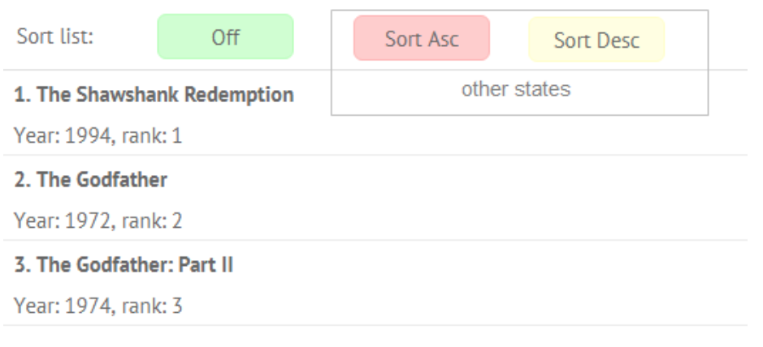

The task is to create a button with three states: ”Off”, “Sort Asc”, “Sort Desc” in order to sort/unsort data. 

The mockup is 

The hints were:
1) use webix.protoUI to inherit from UI button
2) use webix.html helpers to modify button css
    define a different CSS class for each state and describe it in a stylesheet
3) make it possible to define states and the initial state in configuration
    provide state ids and labels to separate logic and visual levels
4) use button onItemClick event to modify the state
    the $init handler is the best place to attach built-in event handlers
    when state is modified and reflected in button ui, call the state change event